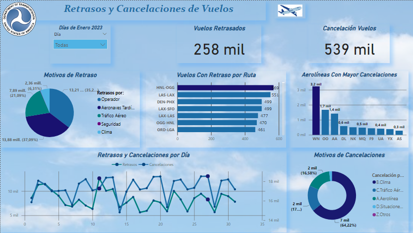

# ✈ Proyecto 4: DataLab

Datalab, una empresa especializada en análisis de datos, se destaca por su enfoque innovador en la toma de decisiones informada para el éxito empresarial. Como socio confiable para diversas empresas, su modelo de consultoría único permite a los analistas de datos elegir proyectos alineados con sus intereses, fomentando un ambiente dinámico y creativo.&#x20;

Datalab se ha concluido con éxito el proyecto centrado en el análisis de datos de cancelaciones y retrasos de vuelos.

El conjunto de datos, proveniente del Departamento de Transporte de EE.UU. y disponible en Kaggle, ha sido explorado a fondo, revelando patrones y tendencias significativas en las cancelaciones y retrasos de vuelos. Las variables clave, como rutas de vuelo, rangos de tiempo para eventos y motivos de retrasos, se han analizado utilizando tanto el lenguaje SQL en BigQuery como Python en Google Colab.

### **Herramientas - Lenguajes - Plataformas** 

La elección de herramientas, como BigQuery para consultas SQL, Power BI para visualización, Google Colab para análisis en Python y Canva para la presentación de resultados, ha facilitado un flujo de trabajo integrado y eficiente. Los insights generados a partir del análisis han proporcionado soluciones valiosas y enriquecedoras para abordar los desafíos relacionados con las cancelaciones y retrasos de vuelos.

#### Este proyecto más la combinación de habilidades técnicas y enfoque innovador ha demostrado ser efectiva para abordar problemas empresariales específicos.

## Dashboard

<figure><figcaption></figcaption></figure>
