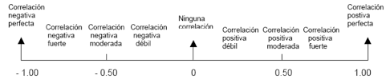

# Hito 1. Correlación entre las Variables Numéricas

### OPRIME <mark style="color:red;">**Colab Colaboratory**</mark> Se relaciona todos los calculos realizados.



<figure><figcaption></figcaption></figure>

### Conclusiones

La correlación es una medida estadística que indica la fuerza y dirección de una relación lineal entre dos variables. Puede variar entre -1 y 1, donde:

* 1 significa una correlación positiva perfecta (a medida que una variable aumenta, la otra también lo hace en la misma proporción).
* \-1 significa una correlación negativa perfecta (a medida que una variable aumenta, la otra disminuye en la misma proporción).
* 0 significa que no hay una correlación lineal.

1.  **Correlación entre ARR\_DELAY y DEP\_DELAY: 0.9400778480455102**

    * **Explicación:** Hay una fuerte correlación positiva (0.94) entre la diferencia en minutos entre la hora de llegada prevista y real (ARR\_DELAY) y la diferencia en minutos entre la hora de salida prevista y real (DEP\_DELAY). Esto indica que, en general, vuelos que tienen retrasos en la salida tienden a tener retrasos en la llegada, y viceversa.
    * **Correlación entre ARR\_DELAY y ELAPSED\_DELAY: -0.3585672329243136**
      * **Explicación:** Existe una correlación negativa moderada (-0.36) entre la diferencia en minutos entre la hora de llegada prevista y real (ARR\_DELAY) y la diferencia en minutos entre el tiempo total de vuelo transcurrido y el tiempo total de vuelo transcurrido real (ELAPSED\_DELAY). Esto sugiere que vuelos con retrasos en la llegada tienden a tener menores diferencias en el tiempo total de vuelo transcurrido.
    * **Correlación entre ARR\_DELAY y DELAY\_DUE\_CARRIER: 0.32340139932838385**
      * **Explicación:** Hay una correlación positiva (0.32) entre la diferencia en minutos entre la hora de llegada prevista y real (ARR\_DELAY) y el retraso atribuido al operador de la aerolínea (DELAY\_DUE\_CARRIER). Esto indica que el retraso del operador de la aerolínea contribuye al retraso en la llegada.
    * **Correlación entre ARR\_DELAY y DELAY\_DUE\_WEATHER: 0.16986664734248974**
      * **Explicación:** Existe una correlación positiva (0.17) entre la diferencia en minutos entre la hora de llegada prevista y real (ARR\_DELAY) y el retraso debido a condiciones meteorológicas (DELAY\_DUE\_WEATHER). Esto sugiere que las condiciones meteorológicas adversas contribuyen al retraso en la llegada.
    * **Correlación entre ARR\_DELAY y DELAY\_DUE\_NAS: 0.1585968622354697**
      * **Explicación:** Hay una correlación positiva (0.16) entre la diferencia en minutos entre la hora de llegada prevista y real (ARR\_DELAY) y el retraso atribuido al Sistema Aéreo Nacional (DELAY\_DUE\_NAS). Esto indica que problemas en el sistema aéreo nacional pueden contribuir al retraso en la llegada.
    * **Correlación entre ARR\_DELAY y DELAY\_DUE\_SECURITY: 0.004116278492951491**
      * **Explicación:** La correlación positiva es baja (0.004) entre la diferencia en minutos entre la hora de llegada prevista y real (ARR\_DELAY) y el retraso debido a cuestiones de seguridad (DELAY\_DUE\_SECURITY). Esto sugiere una relación débil entre estos dos.
    * **Correlación entre ARR\_DELAY y DELAY\_DUE\_LATE\_AIRCRAFT: 0.35928659772844646**
      * **Explicación:** Hay una correlación positiva (0.36) entre la diferencia en minutos entre la hora de llegada prevista y real (ARR\_DELAY) y el retraso debido a la llegada tardía de la aeronave asignada (DELAY\_DUE\_LATE\_AIRCRAFT). Esto indica que la llegada tardía de la aeronave asignada contribuye al retraso en la llegada.
    * **Correlación entre ARR\_DELAY y CANCELLED: 0.003181822810102347**
      * **Explicación:** La correlación positiva es baja (0.003) entre la diferencia en minutos entre la hora de llegada prevista y real (ARR\_DELAY) y la variable de vuelo cancelado (CANCELLED). Esto sugiere una relación débil entre el retraso en la llegada y si el vuelo fue cancelado.

    Estas correlaciones proporcionan información sobre cómo las variables independientes están relacionadas con la variable dependiente ARR\_DELAY. Se observa que ciertos factores, como el retraso en la salida, el retraso atribuido al operador de la aerolínea, el retraso debido a condiciones meteorológicas y otros, tienen asociaciones significativas con el retraso en la llegada.

\
